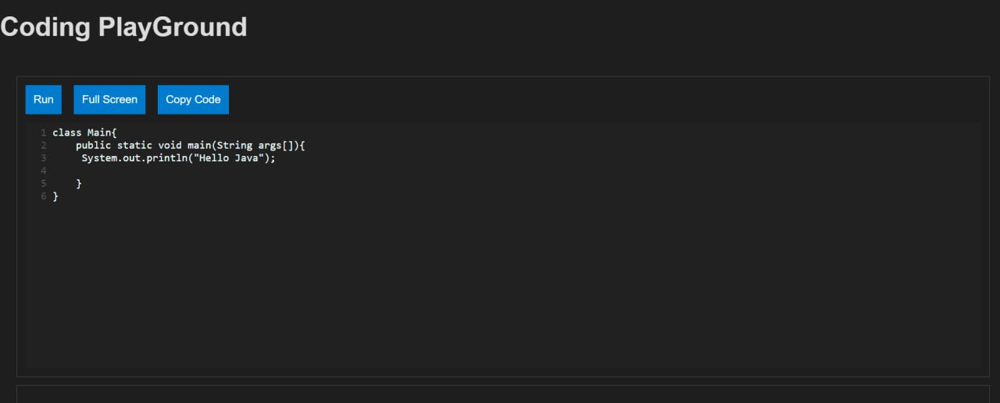
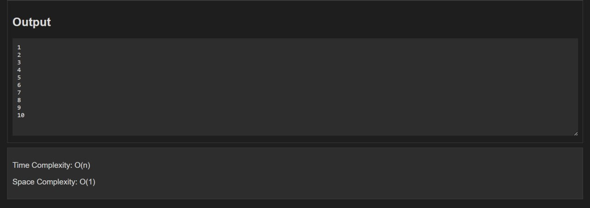
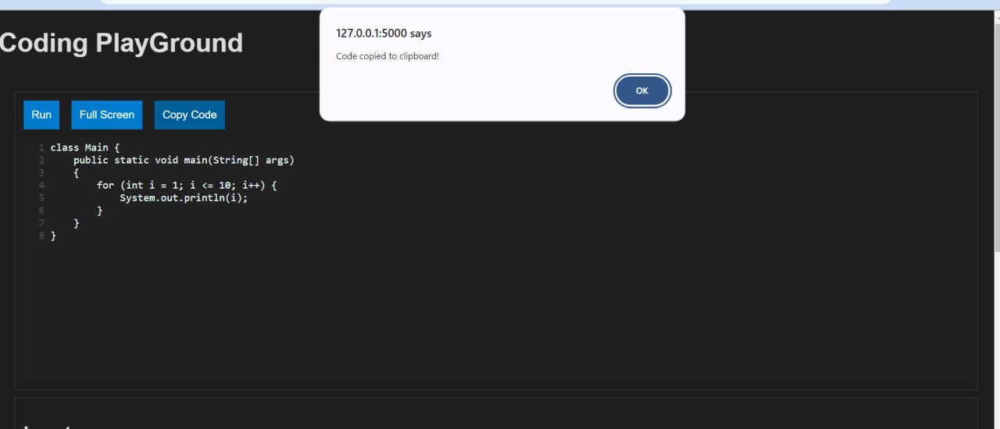

# ProCoder

## Overview
This project is an Online Java Compiler built using HTML, CSS, Flask, and JavaScript. It allows users to write Java code, run it directly in the browser, and view the output on the same page. The compiler can also handle telling time and space complexity of the code, making it an interactive and user-friendly tool for coding in Java.

## Features
1. Write and Compile Java Code: Users can write their Java code directly in the web interface and compile it with a single click.
2. Time Complexity: User can see the time complexity of the written code.
3. Space Complexity: User can see the space complexity of the written code.
4. Simple and Intuitive UI: The interface is minimalistic, focusing on the code and output.
5. Copy Code: You can copy the code written to the clipboard 

## Technologies Used
### Frontend: 
HTML, CSS, JavaScript
### Backend: 
Flask (Python)
### Java: 
The core programming language for the compiler.

## Screenshots
### Main Interface

### Output Interface

